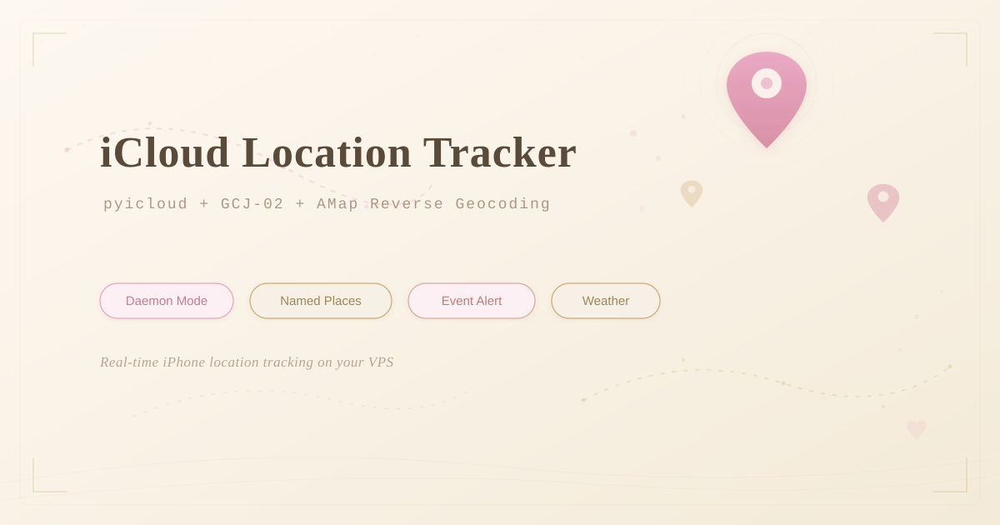

<p align="center">
  
</p>

<h1 align="center">iCloud Location Tracker</h1>

<p align="center">
  <b>在 VPS 上持久运行的 iPhone 定位系统</b><br/>
  <sub>pyicloud · GCJ-02 坐标转换 · 高德逆地理编码 · 常用地点检测 · 天气</sub>
</p>

<p align="center">
  
  
  
  
</p>

---

## 这个项目是做什么的？

简单说：**每 10 分钟自动查一次 iPhone 的位置，把坐标翻译成人类看得懂的地址，然后推送出去。**

它跑在 VPS 上，是一个常驻进程（daemon），不需要你反复登录 iCloud，也不需要打开任何 App。

除了基本的定位，它还能：

- 自动识别你到了哪个常用地点（家、学校、公司……），并在**到达和离开时推送通知**
- 离家超过一定距离时发出**远离警报**
- 顺便查一下当前位置的**实时天气**

```
你的 iPhone
    ↓ pyicloud 通过 Find My iPhone API 拿到 GPS 坐标
你的 VPS（Python daemon）
    ├── 坐标转换：GPS 坐标 → 中国地图坐标
    ├── 高德 API：坐标 → 地址 + 附近地标
    ├── Open-Meteo：坐标 → 天气
    ├── 匹配常用地点 → 检测"到了""走了"
    └── 打包推送到你的后端
```

---

## 核心思路

### 1. 为什么是 daemon，不是 cron？

最直觉的做法是写个脚本，用 cron 每 10 分钟跑一次。但 iCloud 的登录态（session）只能维持几个小时。cron 每次启动一个新进程，session 很快就会过期，然后就要重新输密码和验证码。

解决方案是让程序**常驻运行**。Python 进程不退出，iCloud 的登录态就一直活在内存里。再加上每 30 分钟做一次轻量的"心跳"请求，iCloud 就不会觉得你下线了。

> 💡 **打个比方**：cron 就像每隔 10 分钟敲一次别人家的门，每次都要重新证明"我是我"。daemon 就像你进了门之后就坐在客厅里，隔一会儿跟主人说句话，让他知道你还在。

### 2. 坐标转换是怎么回事？

iPhone 给的坐标是 GPS 标准坐标（WGS-84），全世界通用。但中国的地图服务（高德、腾讯、百度）用的是一套偏移过的坐标（GCJ-02），俗称**火星坐标系**。

如果不做转换，直接拿 GPS 坐标去查地址，返回的结果会**偏 500 到 2000 米**。比如你明明在家，查出来的地址可能是 2 公里外的某个地方。

转换算法是公开的，网上有很多版本，但**坑也很多**。最常见的错误是计算偏移量时少了一步减法（需要先减去一个参考点坐标），直接导致偏移方向和幅度都不对，而且不会报错，非常难发现。

> 💡 **验证方法**：找一个你确切知道位置的地点，转换后去高德地图搜坐标，看落点对不对。

### 3. 高德逆地理编码

拿到正确的 GCJ-02 坐标后，调高德的 API 就能得到可读的地址和附近的地标（POI）。

两个最容易踩的坑：
- 高德的坐标参数是**经度在前、纬度在后**（跟直觉相反）
- POI 的距离字段是**字符串类型的浮点数**（比如 `"123.343"`），不能用 `int()` 解析

### 4. 常用地点检测

预先定义几个地点（家、学校等），每次查到位置后算一下和每个地点的距离。如果落在某个地点的半径范围内（比如 200 米），就认为"到了"。

在 daemon 的内存里记住上一次在哪里，就能检测出状态变化：

| 上次 | 这次 | 事件 |
|------|------|------|
| 不在任何地点 | 在家 | `arrived_home` |
| 在学校 | 不在任何地点 | `left_school` |
| 不在任何地点 | 不在任何地点 + 离家 >1km | `far_from_home` |

### 5. 天气

既然已经有坐标了，顺手查一下天气几乎零成本。用 [Open-Meteo](https://open-meteo.com/)，完全免费，不需要 API Key。而且它用 WGS-84 坐标，不需要做坐标转换。

### 6. 用 systemd 管理

写一个 systemd service，让 daemon 开机自启。不过第一次启动需要手动认证（输密码和验证码），之后 daemon 会自己保持登录态。

---

## 快速开始

```bash
# 1. 安装依赖
pip install pyicloud requests

# 2. 首次认证（需要输入密码和 2FA 验证码）
ICLOUD_PW="你的密码" python3 -u geo-poll.py

# 3. 认证成功后 Ctrl+C，然后用 systemd 接管
sudo systemctl start geo-tracker
sudo journalctl -u geo-tracker -f   # 看日志
```

> ⚠️ 密码只在首次认证时使用，之后不需要。**不要把密码存在文件里。**

---

## 踩过的坑

| 坑 | 表现 | 原因 | 怎么避免 |
|---|---|---|---|
| 坐标转换少了减法 | 定位偏了 2km，地标全是远处的 | 转换算法里 `x` 要用 `lon-105`，不是 `lon` | 用可靠的转换库，或者拿已知地点验证 |
| 高德参数顺序反了 | 地址完全不对，不报错 | `location=经度,纬度`，不是纬度经度 | 仔细看文档，调试时先拿已知地点测 |
| POI 距离用 `int()` 解析 | `ValueError` 崩溃 | 距离是浮点字符串 `"123.343"` | 一律用 `float()` |
| cron 模式 token 过期 | 每天要重新登录 | session 没有心跳保活 | 改成 daemon + 心跳 |
| session 文件存 `/tmp` | 重启后要重新认证 | `/tmp` 重启时会被清空 | 指定持久化的 `cookie_directory` |

---

## 依赖

| 名称 | 用途 | 备注 |
|------|------|------|
| Python 3.10+ | 运行环境 | |
| [pyicloud](https://github.com/picklepete/pyicloud) | iCloud API | `pip install pyicloud` |
| [高德开放平台](https://lbs.amap.com/) Key | 逆地理编码 | 免费，每天 5000 次 |
| [Open-Meteo](https://open-meteo.com/) | 天气 | 免费，无需 Key |

---

## 安全提示

- **密码不要写进文件**，用环境变量传入，认证完成后只在内存中
- Session 文件包含登录 token，做好文件权限保护（`chmod 700`）
- 定位数据是敏感信息，传输链路要加密（HTTPS）

---

<p align="center">
  <sub>MIT License</sub>
</p>
