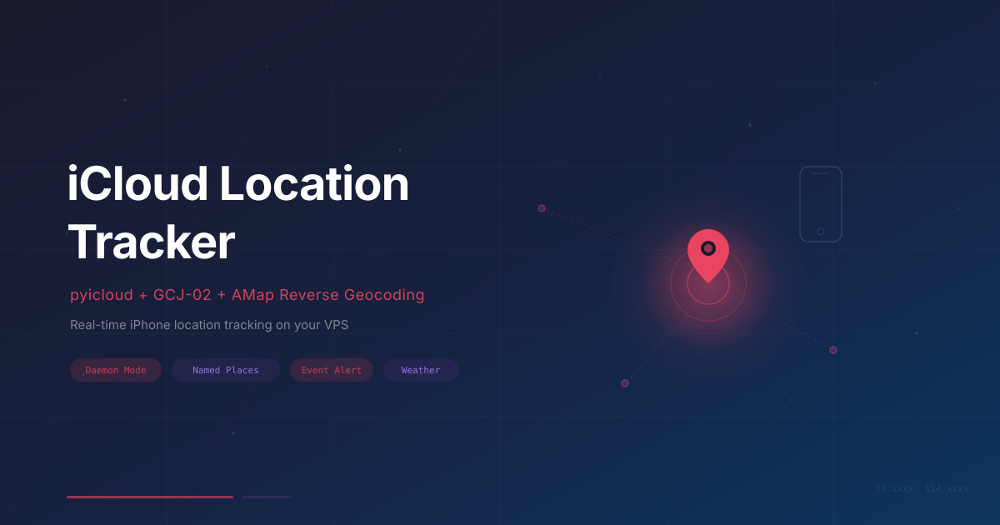

# iCloud Location Tracker

> 在 VPS 上持久运行的 iPhone 定位追踪系统：pyicloud + 坐标转换 + 高德逆地理编码 + 常用地点检测 + 天气查询。

---

## 目录

- [这是什么](#这是什么)
- [Quick Start](#-quick-start)
- [架构概览](#架构概览)
- [深入解析](#深入解析)
  - [iCloud 会话管理：为什么是 daemon 而不是 cron](#-icloud-会话管理为什么是-daemon-而不是-cron)
  - [坐标转换：WGS-84 到 GCJ-02 的那些事](#-坐标转换wgs-84-到-gcj-02-的那些事)
  - [高德逆地理编码：经纬度变成人话](#-高德逆地理编码经纬度变成人话)
  - [常用地点检测：到家了、出门了](#-常用地点检测到家了出门了)
  - [天气集成](#-天气集成)
  - [用 systemd 跑起来](#-用-systemd-跑起来)
- [踩过的坑](#-踩过的坑)
- [依赖](#-依赖)
- [安全注意事项](#-安全注意事项)
- [License](#license)

---

## 这是什么

这个项目的起因很简单——我想在 VPS 上随时知道 iPhone 的位置。听起来不难，但真正动手做的时候踩了不少坑。

iCloud 的 Find My iPhone 功能可以通过 pyicloud 这个 Python 库来调用，但它的 session 机制、中国特色的坐标偏移、高德 API 的各种小陷阱，加在一起足够折腾一阵子。这个教程把我从零搭建过程中遇到的问题和解决思路完整记录下来，希望能帮后来人少走弯路。

最终实现的功能：

- **持久化定位轮询**：daemon 模式运行，每 10 分钟查一次 iPhone 位置，自动心跳保活
- **坐标转换**：把 iCloud 返回的 WGS-84 坐标转成中国地图能用的 GCJ-02
- **逆地理编码**：经纬度翻译成可读地址和附近地标
- **常用地点检测**：识别"到家了""到学校了""离开了"这些状态变化
- **远离警报**：离家超过设定距离时推送通知
- **天气查询**：顺手拿到当前位置的实时天气

---

## 架构概览

```
iPhone (iCloud)
    | pyicloud (Find My iPhone API)
    v
VPS Daemon (Python, 常驻进程)
    |
    +-- 坐标转换 WGS-84 -> GCJ-02
    +-- 高德逆地理编码 -> 可读地址 + 附近 POI
    +-- Open-Meteo -> 实时天气
    +-- 常用地点匹配 + 到达/离开事件检测
    +-- 推送到后端 (HTTP POST)
```

数据流很直白：pyicloud 拿到 GPS 原始坐标，转换后丢给高德做逆地理编码，同时匹配预设的常用地点，最后把所有信息打包推送出去。整个流程跑在一个 Python daemon 里，不依赖 cron，不依赖外部调度。

---

## 🚀 Quick Start

> 假设你已经有一台 VPS、Python 3.10+ 和一个高德开放平台 API Key。

**1. 安装依赖**

```bash
pip install pyicloud requests
```

**2. 首次认证（交互式）**

```bash
ICLOUD_PW="你的密码" python3 -u geo-poll.py
```

首次运行会要求输入 2FA 验证码，通过后 session 会缓存到本地。认证成功、确认定位数据正常输出后，`Ctrl+C` 退出。

**3. 用 systemd 接管**

```bash
sudo systemctl start geo-tracker
sudo systemctl enable geo-tracker   # 开机自启
journalctl -u geo-tracker -f        # 看日志
```

之后 daemon 会自动保持 session 活着。除非 Apple 强制登出（比如你改了密码），否则不需要再手动认证。

> **提示**：如果你只是想快速跑起来看看效果，到这里就够了。下面是每个模块的详细解析，适合想理解原理或者遇到问题需要排查的情况。

---

## 深入解析

### 🔄 iCloud 会话管理：为什么是 daemon 而不是 cron

我最初的想法很自然：写个脚本，用 cron 每 10 分钟跑一次。简单直接。但很快就发现这条路走不通。

**问题在于 pyicloud 的 session 机制。** 每次创建 `PyiCloudService` 实例时，它会尝试从本地缓存恢复 session。但 iCloud 的 session token 只有几个小时的有效期。一旦过期，下一次 cron 触发时就会认证失败，需要重新输入密码和 2FA 验证码。在 VPS 上这是不可接受的——你不可能每隔几小时手动输一次验证码。

**解决方案是 daemon 模式。** 进程常驻内存，`PyiCloudService` 实例一直活着。只要定期做轻量级的 API 调用（我选择每 30 分钟调一次 `api.devices`），iCloud 就会认为这个 session 还在活跃，不会让它过期。

<details>
<summary>核心代码：daemon 循环 + 心跳保活</summary>

```python
from pyicloud import PyiCloudService
import time

# 首次启动时认证
api = PyiCloudService("your@apple.id", password, china_mainland=True)

if api.requires_2fa:
    code = input("验证码: ")
    api.validate_2fa_code(code)

last_keepalive = time.time()

while True:
    # 每 10 分钟查位置
    poll_location(api)

    # 每 30 分钟心跳保活，防止 session 过期
    if time.time() - last_keepalive > 1800:
        list(api.devices)  # 轻量 API 调用
        last_keepalive = time.time()

    time.sleep(30)  # 主循环每 30 秒检查一次
```

</details>

为什么心跳间隔选 30 分钟？这是试出来的。太频繁（比如每 5 分钟）没必要，浪费请求；太长（比如 2 小时）有时候会赶不上 token 刷新窗口。30 分钟是一个稳定的甜蜜点。

还有一个细节：daemon 重启后怎么办？pyicloud 会把 session 信息缓存在本地文件里（默认在 `/tmp/pyicloud/`）。重启时可以先尝试无密码恢复：

<details>
<summary>Session 恢复逻辑</summary>

```python
def try_resume():
    """尝试从缓存的 session 恢复，不需要密码"""
    api = PyiCloudService("your@apple.id", china_mainland=True)
    if api.requires_2fa:
        return None  # session 已过期，需要重新认证
    try:
        list(api.devices)  # 验证 session 是否真的有效
        return api
    except:
        return None
```

</details>

> **注意**：`/tmp` 在某些系统上重启后会被清空。如果你发现每次重启都要重新认证，把 `cookie_directory` 指向一个持久路径，比如 `/var/lib/geo-tracker/session/`。

---

### 🌍 坐标转换：WGS-84 到 GCJ-02 的那些事

这一步是整个项目里最容易出错、也最难调试的部分。

**背景知识**：GPS 卫星给出的坐标使用 WGS-84 坐标系，这是一个全球统一的标准。但中国出于测绘安全考虑，强制要求所有国内地图服务使用一套经过非线性偏移的坐标系，叫 GCJ-02，俗称"火星坐标系"。高德、腾讯地图都用 GCJ-02，百度在此基础上又做了一次偏移（BD-09）。

这意味着：如果你拿 iCloud 返回的 WGS-84 坐标直接去调高德的逆地理编码 API，返回的地址会偏移 500 到 2000 米，完全不可用。

转换算法本身不复杂，但网上流传的版本有不少是错的。最常见的错误是偏移量计算时没有减去参考点坐标。

<details>
<summary>完整转换代码</summary>

```python
import math

def wgs84_to_gcj02(lat, lon):
    """WGS-84 坐标转 GCJ-02（火星坐标系）"""
    # 中国范围外不需要转换
    if lon < 72.004 or lon > 137.8347 or lat < 0.8293 or lat > 55.8271:
        return lat, lon

    a = 6378245.0           # 克拉索夫斯基椭球体长半轴
    ee = 0.00669342162296594  # 偏心率平方

    # 关键：以 (35, 105) 为参考点计算偏移
    x = lon - 105.0
    y = lat - 35.0

    # 纬度偏移
    dlat = -100.0 + 2.0*x + 3.0*y + 0.2*y*y + 0.1*x*y + 0.2*math.sqrt(abs(x))
    dlat += (20.0*math.sin(6.0*x*math.pi) + 20.0*math.sin(2.0*x*math.pi)) * 2.0/3.0
    dlat += (20.0*math.sin(y*math.pi) + 40.0*math.sin(y/3.0*math.pi)) * 2.0/3.0
    dlat += (160.0*math.sin(y/12.0*math.pi) + 320*math.sin(y*math.pi/30.0)) * 2.0/3.0

    # 经度偏移
    dlon = 300.0 + x + 2.0*y + 0.1*x*x + 0.1*x*y + 0.1*math.sqrt(abs(x))
    dlon += (20.0*math.sin(6.0*x*math.pi) + 20.0*math.sin(2.0*x*math.pi)) * 2.0/3.0
    dlon += (20.0*math.sin(x*math.pi) + 40.0*math.sin(x/3.0*math.pi)) * 2.0/3.0
    dlon += (150.0*math.sin(x/12.0*math.pi) + 300.0*math.sin(x/30.0*math.pi)) * 2.0/3.0

    # 椭球体修正
    radlat = lat / 180.0 * math.pi
    magic = math.sin(radlat)
    magic = 1 - ee * magic * magic
    sqrtmagic = math.sqrt(magic)
    dlat = (dlat * 180.0) / ((a * (1 - ee)) / (magic * sqrtmagic) * math.pi)
    dlon = (dlon * 180.0) / (a / sqrtmagic * math.cos(radlat) * math.pi)

    return lat + dlat, lon + dlon
```

</details>

这段代码里最核心的两行是 `x = lon - 105.0` 和 `y = lat - 35.0`。105 和 35 是中国大致的地理中心点。所有后续的三角函数偏移量都是基于这个相对坐标来计算的。如果你跳过这步减法，直接用原始经纬度代入，算出来的偏移方向和幅度都是错的。

> **怎么验证转换是否正确？** 找一个你知道确切位置的地点，把 WGS-84 坐标手动转一次，然后在高德地图上搜这个 GCJ-02 坐标，看标记点是不是落在正确的位置上。如果偏了几百米以上，转换算法肯定有问题。

---

### 📍 高德逆地理编码：经纬度变成人话

有了正确的 GCJ-02 坐标，就可以调高德的逆地理编码 API，把经纬度翻译成"XX市XX区XX路XX号"这样的可读地址，顺便拿到附近的 POI（兴趣点，比如商场、餐厅、学校）。

<details>
<summary>逆地理编码代码</summary>

```python
import requests

AMAP_KEY = "YOUR_AMAP_KEY"

def amap_reverse(lat, lon):
    """WGS-84 坐标逆地理编码，返回地址和附近地标"""
    gcj_lat, gcj_lon = wgs84_to_gcj02(lat, lon)

    # 注意：高德的参数顺序是 经度,纬度
    url = (
        f"https://restapi.amap.com/v3/geocode/regeo"
        f"?key={AMAP_KEY}"
        f"&location={gcj_lon},{gcj_lat}"
        f"&extensions=all"
        f"&radius=200"
    )
    data = requests.get(url).json()

    regeocode = data.get("regeocode", {})
    address = regeocode.get("formatted_address", "")
    pois = regeocode.get("pois", [])

    # 只取 500 米内的 POI，最多 3 个
    nearby = [
        p["name"] for p in pois
        if float(p.get("distance", 9999)) <= 500
    ][:3]

    return address, nearby
```

</details>

这里有两个特别容易踩的坑，我都踩了：

1. **参数顺序**：高德 API 的 `location` 参数是 **经度在前，纬度在后**（`lon,lat`）。这跟大多数人的直觉相反（我们通常说"纬度经度"），也跟 pyicloud 返回的 `latitude, longitude` 顺序相反。搞反了不会报错，只会返回一个完全不对的地址，调试起来很抓狂。

2. **POI 距离字段的类型**：高德返回的 POI 列表里，`distance` 字段是字符串类型的浮点数，比如 `"123.343"`。如果你用 `int()` 来解析，遇到小数点就会抛 `ValueError`。必须用 `float()`。

> **关于 `extensions=all`**：这个参数让高德返回完整的 POI 列表。默认的 `extensions=base` 只返回地址，不返回附近地标。如果你不需要 POI 可以省掉它，能稍微加快响应速度。

---

### 🏠 常用地点检测：到家了、出门了

有了精确的坐标，下一步是判断"人在哪个地方"。我的做法是预定义一组常用地点（家、学校、公司等），每次查到位置后计算和每个地点的距离，看是否落在某个地点的半径范围内。

<details>
<summary>地点匹配 + 事件检测代码</summary>

```python
import math

PLACES = [
    {"name": "home",   "label": "家",   "lat": xx.xxxx, "lon": xxx.xxxx, "radius": 200},
    {"name": "school", "label": "学校", "lat": xx.xxxx, "lon": xxx.xxxx, "radius": 200},
    # 可以继续添加...
]

def haversine(lat1, lon1, lat2, lon2):
    """计算两点之间的地球表面距离（米）"""
    R = 6371000
    phi1, phi2 = math.radians(lat1), math.radians(lat2)
    dphi = math.radians(lat2 - lat1)
    dlambda = math.radians(lon2 - lon1)
    a = math.sin(dphi/2)**2 + math.cos(phi1)*math.cos(phi2)*math.sin(dlambda/2)**2
    return R * 2 * math.atan2(math.sqrt(a), math.sqrt(1-a))

def find_named_place(lat, lon):
    """找到当前坐标最近的常用地点（如果在半径范围内）"""
    best = None
    best_dist = float('inf')
    for p in PLACES:
        d = haversine(lat, lon, p["lat"], p["lon"])
        if d <= p["radius"] and d < best_dist:
            best = p
            best_dist = d
    return best
```

</details>

地点匹配本身很简单，有意思的是**事件检测**——不只是知道"人在哪里"，还要知道"刚到了"还是"刚离开了"。这需要在 daemon 内存里维护上一次的状态：

<details>
<summary>状态变化检测</summary>

```python
prev_place = None

def detect_event(current_place, dist_home):
    """检测地点状态变化，返回事件类型"""
    global prev_place
    event = None

    if current_place and current_place != prev_place:
        event = "arrived_" + current_place   # arrived_home, arrived_school
    elif not current_place and prev_place:
        event = "left_" + prev_place         # left_home, left_school

    # 离家超过 1km 且不在任何常用地点时触发
    if not current_place and dist_home > 1000:
        event = event or "far_from_home"

    prev_place = current_place
    return event
```

</details>

关于 `radius`（半径）的选择：200 米对大多数场景够用了。GPS 定位本身有 10~50 米的误差，加上建筑物遮挡可能更大。设太小（比如 50 米）会导致在地点边缘反复触发"到达/离开"事件；设太大（比如 1000 米）会失去精度。200 米是一个平衡点。

> **提示**：`far_from_home` 事件只在第一次检测到时触发一次。如果你想做"每小时提醒一次还在外面"，需要额外加一个计时器逻辑。

---

### 🌤️ 天气集成

既然已经有了精确坐标，顺手查一下当前位置的天气几乎是零成本的事情。我用的是 [Open-Meteo](https://open-meteo.com/)，一个完全免费、不需要 API Key 的天气接口。

```python
def get_weather(lat, lon):
    """获取当前位置的实时天气（使用 WGS-84 坐标，不需要转换）"""
    url = (
        f"https://api.open-meteo.com/v1/forecast"
        f"?latitude={lat}&longitude={lon}"
        f"&current=temperature_2m,weathercode,windspeed_10m,relative_humidity_2m"
        f"&timezone=auto"
    )
    data = requests.get(url, timeout=10).json()
    current = data.get("current", {})
    return {
        "temperature": current.get("temperature_2m"),
        "humidity": current.get("relative_humidity_2m"),
        "windspeed": current.get("windspeed_10m"),
        "weathercode": current.get("weathercode"),
    }
```

> **注意**：Open-Meteo 使用 WGS-84 坐标，不需要做 GCJ-02 转换。只有调中国地图服务商的 API 才需要转换。

---

### ⚙️ 用 systemd 跑起来

Python daemon 写好之后，需要一个进程管理器来保证它持久运行。systemd 是 Linux 上最自然的选择。

```ini
[Unit]
Description=iCloud Location Tracker Daemon
After=network.target

[Service]
Type=simple
ExecStart=/usr/bin/python3 -u /path/to/geo-poll.py
Restart=no
StandardOutput=journal
StandardError=journal

[Install]
WantedBy=multi-user.target
```

几个要点：

- **`-u` 参数**：让 Python 的 stdout 不做缓冲，这样 `print()` 的日志能实时出现在 journalctl 里。不加这个参数，你可能要等到缓冲区满了才能看到输出。
- **`Restart=no`**：我选择不自动重启。因为如果 daemon 退出，通常是因为 iCloud session 过期，需要人工介入重新认证。自动重启只会反复失败。
- **首次启动必须交互式**：因为需要输入密码和 2FA 验证码，第一次不能直接用 systemd 启动。先在终端里手动跑通，确认 session 缓存成功后，再交给 systemd。

```bash
# 第一次：手动认证
ICLOUD_PW="你的密码" python3 -u /path/to/geo-poll.py
# 看到定位数据正常输出后 Ctrl+C

# 之后：systemd 接管
sudo systemctl daemon-reload
sudo systemctl start geo-tracker
sudo systemctl enable geo-tracker
```

---

## 🕳️ 踩过的坑

做这个项目的过程就是一个连环踩坑的过程。每一个坑都不难解决，但如果你不知道坑在哪里，调试起来会非常痛苦。这里把我踩过的每一个坑都详细记录下来。

### 坐标转换少了一步减法

**症状**：定位能跑通，高德 API 也正常返回地址，但返回的地址和实际位置偏了将近 2 公里。附近地标全是 2km 以外的建筑。

**原因**：WGS-84 到 GCJ-02 的转换算法里，需要先把经纬度减去一个参考点（105, 35）得到相对坐标，然后用相对坐标去做三角函数运算。网上很多版本的代码直接用原始经纬度代入了，结果偏移方向和幅度都不对。

**修复**：确保 `x = lon - 105.0`, `y = lat - 35.0` 这两行存在，并且后续的 `dlat`/`dlon` 计算用的是 `x` 和 `y`，不是 `lon` 和 `lat`。

**教训**：坐标偏移这种问题特别阴险，因为它不会报错，返回的数据格式也完全正常，只是内容不对。验证方法是拿一个你确切知道位置的坐标去测。

### 高德 API 参数顺序反了

**症状**：逆地理编码返回的地址完全对不上，比如人在北京但返回的是某个不知名的小城市。

**原因**：高德 API 的 `location` 参数格式是 `经度,纬度`（lon,lat），而不是更常见的 `纬度,经度`（lat,lon）。把两个值搞反不会触发任何错误，API 会照常返回一个看起来完全正常的 JSON 响应，只是对应的是地球上另一个点。

**修复**：`location={gcj_lon},{gcj_lat}`，经度在前。

**教训**：调地图 API 时，第一件事就是确认参数顺序。不同服务商的约定不一样。

### POI 距离字段用 int() 解析

**症状**：daemon 跑着跑着突然 crash，报 `ValueError: invalid literal for int() with base 10: '123.343'`。

**原因**：高德返回的 POI 列表里，`distance` 字段是字符串类型的浮点数（比如 `"123.343"`、`"0.0"`），不是整数。用 `int("123.343")` 在 Python 里会直接报错。

**修复**：用 `float()` 代替 `int()`。

**教训**：永远不要假设 API 返回的数值字段是整数。先打印一条原始响应看看实际格式。

### cron 模式下 session 频繁过期

**症状**：每天要重新输入密码和 2FA 验证码。

**原因**：cron 每 10 分钟启动一个新的 Python 进程，每次都要重新创建 `PyiCloudService` 实例。虽然 pyicloud 会尝试从缓存恢复 session，但 iCloud 的 token 只有几个小时的有效期，而 cron 模式下没有心跳保活机制来延长它。

**修复**：改成 daemon 模式，进程常驻，session 实例一直活在内存里，每 30 分钟做一次心跳调用。

### session 缓存目录在 /tmp

**症状**：VPS 重启后 session 丢失，必须重新认证。

**原因**：pyicloud 默认把 session 文件存在 `/tmp/pyicloud/`。有些 Linux 发行版在重启时会清空 `/tmp`。

**修复**：创建 `PyiCloudService` 时指定 `cookie_directory` 到一个不会被清空的路径：

```python
api = PyiCloudService(
    "your@apple.id",
    cookie_directory="/var/lib/geo-tracker/session/"
)
```

---

## 📦 依赖

| 依赖 | 用途 | 备注 |
|------|------|------|
| Python 3.10+ | 运行环境 | |
| [pyicloud](https://github.com/picklepete/pyicloud) | iCloud API 封装 | `pip install pyicloud` |
| [requests](https://docs.python-requests.org/) | HTTP 请求 | `pip install requests` |
| [高德开放平台](https://lbs.amap.com/) API Key | 逆地理编码 | 免费申请，每天 5000 次 |
| [Open-Meteo](https://open-meteo.com/) | 天气数据 | 完全免费，无需 Key |

---

## 🔒 安全注意事项

- **Apple ID 密码不要写进文件**。通过环境变量传入，认证完成后密码只存在进程内存中。代码里不要有任何 hardcode 的密码。
- **session 文件要保护好权限**。pyicloud 的 session 缓存（默认在 `/tmp/pyicloud/`）包含登录 token，拿到就等于拿到了你的 iCloud 访问权。建议 `chmod 700` 并且只允许运行用户访问。
- **高德 API Key 有调用频率限制**。免费版每天 5000 次逆地理编码，10 分钟查一次一天才 144 次，完全够用。但如果你在调试时频繁调用，注意不要超限。
- **定位数据是敏感信息**。推送到后端的数据包含精确坐标和地址，确保传输链路有加密（HTTPS），后端存储也要有访问控制。

---

## License

MIT
